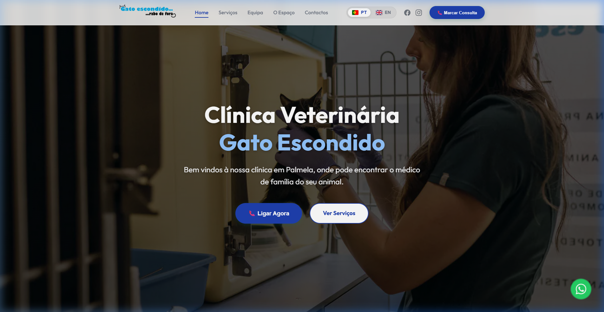
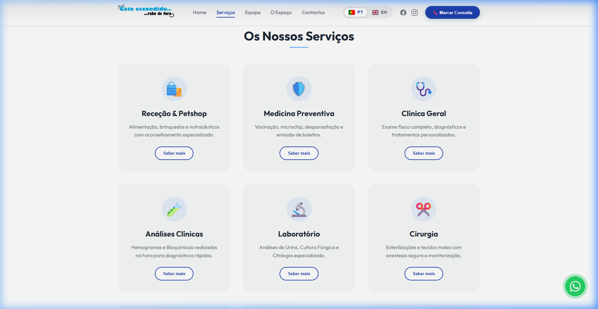
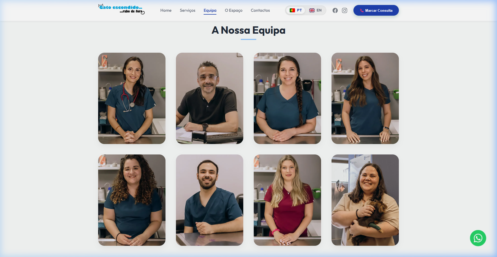
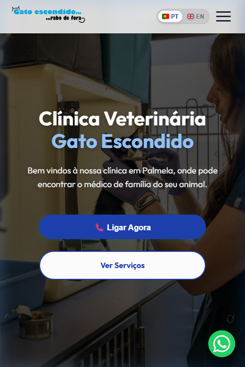

# 🐾 Clínica Veterinária Gato Escondido



Este é o repositório oficial do novo website da **Clínica Veterinária Gato Escondido**. Um projeto focado em performance extrema, design moderno e acessibilidade total, agora também preparado para a era da Inteligência Artificial.

---

## 🌐 Site Live
[www.gatoescondido.com](https://www.gatoescondido.com)

---

## ✨ Características Principais

- **Design Premium & Moderno**: Estética minimalista com modo escuro, efeitos de vidro (Glassmorphism) e tipografia elegante.
- **Performance de Elite**: Otimizado para atingir pontuações próximas de 100 no Google PageSpeed Insights.
- **Mobile First**: Experiência fluida e responsiva em todos os dispositivos.
- **Multilingue**: Suporte completo para Português (PT) e Inglês (EN).
- **SEO Avançado**: Estrutura semântica, Schema JSON-LD para negócios locais e sitemap dinâmico.
- **Agent Ready**: Primeiro site veterinário preparado para agentes de IA (Markdown negotiation, WebMCP e API Discovery).

---

## 🛠️ Tech Stack

- **Core**: HTML5, Vanilla JavaScript (ES6+)
- **Styling**: CSS3 (Variáveis, Flexbox, Grid, Animações)
- **Bundler**: [Vite](https://vitejs.dev/)
- **Deployment**: [Vercel](https://vercel.com/)
- **Assets**: Imagens otimizadas em WebP e ícones Lucide/FontAwesome.

---

## 🤖 AI & Agent Readiness

O projeto implementa as diretivas mais recentes para compatibilidade com agentes de IA autónomos:
- **RFC 8288 (Link Headers)**: Descoberta automática de recursos via cabeçalhos HTTP.
- **Content Negotiation**: Entrega de versão Markdown (`Accept: text/markdown`) para consumo de IA.
- **MCP (Model Context Protocol)**: Server card disponível em `/.well-known/mcp/server-card.json`.
- **WebMCP**: Exposição de ferramentas do site via `navigator.modelContext`.
- **Content Signals**: Preferências de uso de conteúdo para treino de IA em `robots.txt`.

---

## 📸 Screenshots

### Versão Desktop


### Serviços & Especialidades


### Equipa Profissional


### Versão Mobile
<p align="center">
  
</p>

---

## 🚀 Como Executar Localmente

1. Clone o repositório:
   ```bash
   git clone https://github.com/Canditos/modern-site-gato.git
   ```
2. Instale as dependências (caso existam):
   ```bash
   npm install
   ```
3. Inicie o servidor de desenvolvimento:
   ```bash
   npm run dev
   ```
4. Build para produção:
   ```bash
   npm run build
   ```

---

## 📝 Licença
© 2026 Clínica Veterinária Gato Escondido. Todos os direitos reservados.
